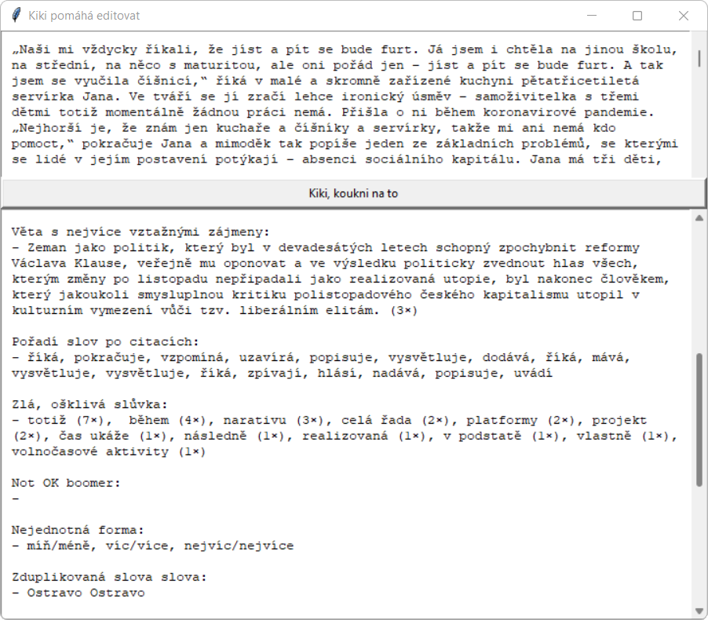

# Kiki

Skript pomáhá odhalovat stylistické nedostatky (českých) textů. Napsal jsem ho, aby mi asistoval při editování zpravodajských a publicistických článků, hodit se ale může i při finišování diplomky nebo románu.



Co přesně umí:

- Upozorňuje na klišé. Poradí si i s různými časy a tvary, neunikne mu _kostlivec ve skříni_ ani _kostlivci ve skříních_. U některých zastaralých, zavádějících nebo nekorektních termínů připojuje vysvětlení a alternativu (_globální oteplování_ → _změna klimatu_).
- Vypisuje slova následující po přímé řeči. Odhaluje tak opakování typu _prozradil – neprozradil – prozradil_.
- Hledá zduplikovaná slova (_jak řekl řekl_).
- Ukazuje termíny v uvozovkách (uvozovky jsou pro strašpytly).
- Vypichuje nejdelší větu (obvykle ji jde zkrátit), věty s nejvíce interpunkčními znaménky a nejvíce vztažnými zájmeny.
- Upozorňuje na (některá) nevhodně použitá interpunkční znaménka.
- Zobrazuje úseky, ve kterých se objevují slova často používaná v nesprávném významu (_díky_, _Čechy_ nebo _Holandsko_).  
- Počítá základní statistiky, jako je rozsah a odhadovaná doba čtení.

Kiki pouze _pomáhá_, ale needituje. Soubor s textem otevírá jen pro čtení, nic v něm nemění. Neřeší, jestli ve švech praská divadlo, nebo sako. Staví vedle sebe jednoznačně odporné fráze i slova, která jsou ok, pokud se to s nimi nepřehání. Neřeší pravopis a překlepy – od toho tu jsou jiné nástroje.

## Použití

Kiki je sice pythonovský skript, k používání ale není nutné znát Python ani umět programovat. Instalace a rozběhnutí však vyžadují základní znalost práce s terminálem/příkazovou řádkou/konzolí. Pokud nemáte ani tu, někoho poproste – je to práce na pár minut.

Ke spuštění skriptu je zapotřebí mít [nainstalovaný Python 3](https://naucse.python.cz/lessons/beginners/install/), k němu ještě knihovny ```markdown``` a ```tkinter``` (```pip install markdown``` + ```pip install tk```).

Složku se skriptem a slovníky si stáhněte, kam potřebujete. Nebo naklonujte repozitář: 

    git clone http://github.com/michalkasparek/kiki

Pro práci v jednoduchém grafickém rozhraní (otestováno na Windows 11, macOS a Xubuntu, čili snad poběží všude) zavolejte skript bez argumentů:

    python kiki.py

Výpis lze také zobrazit přímo v terminálu – stačí jako argument zadat cestu k souboru s textem:

    python kiki.py (cesta_k_dokumentu\)nazev_dokumentu.txt

Kiki si rozumí s prostým textem (například vykopírovaným z Wordu nebo GDocs) i s [markdownem](https://www.lifehacky.cz/oda-na-markdown-co-to-vlastne-je-a-proc-se-bez-nej-neobejdete/).

Pokud chcete pohlídat frázi, kterou Kiki nezná, přidejte ji na samostatný řádek do nového souboru ```ptydepe_pridej.txt``` ve složce ```slovniky```. Podobně lze postupovat, když vám některé hledané fráze nevadí: vytvořte pro ně soubor ```ptydepe_odeber.txt```. Jen pozor: frázi do něj musíte vložit přesně ve tvaru, v jakém se nachází v hlavním slovníku.

## Co je nového

- 0.5: Hledání dublet. Přehlednější výpis ptydepe a boomerštiny. (16. 4. 2022)
- 0.4: Velká refaktorizace: 1/ Zbavení závislosti na obří knihovně NLTK. 2/ Grafické rozhraní. 3/ Rozbor článku je přepsaný jako třída, takže lze Kiki snadno volat z ostatních skriptů, např. redakčních systémů či builderů. (13. 4. 2022)
- 0.3: Hledání vět s nejvíce interpunkčními znaménky a nejvíckrát opakujích zájmeno „kter*“. Upozorňování na zastaralé nebo nekorektní fráze s vysvětlením. (25. 3. 2022)
- 0.2: Seznamy frází už se načítají ze samostatných souborů ve složce _slovniky_. Tamtéž lze do souborů _ptydepe_pridej.txt_ a _ptydepe_odeber.txt_ vložit vlastní řetězce a regulérní výrazy, které má Kiki extra hledat, nebo naopak ignorovat. (22. 2. 2022)

## Co je v plánu

- Další upozornění: opakující se začátky odstavců, chyby v zápisu čísel a v užití pomlček.
- Podpora YAML záhlaví markdownových souborů.
- Průběžné rozšiřování seznamů frází.
- [možná] Podpora formátů OpenDocument a Docx.
- [možná] Spustitelné soubory pro Windows a macOS.

## Zdroje

Seznam nevhodných obratů je posbíraný dílem z osobní praxe, dílem z interních materiálů několika redakcí, mj. MFD, HN a Deníku. Velký dík kolegům a kolegyním za to, že se o ně podělili. 

Pomohly mi i diplomové práce [Heleny Palátové](https://is.muni.cz/th/pvfvs/floskule_bp.pdf) a [Kristýny Fojtů](https://is.muni.cz/th/k9jpn/finalBP_fphnf.pdf).

Modul Not OK boomer čerpá mimo jiné z manuálu [Jak mluvit a psát o lidech s postižením](https://www.ochrance.cz/aktualne/lide-s-postizenim-maji-mit-respekt-kvuli-sobe-nikoli-kvuli-postizeni/) publikovaného kanceláří Veřejného ochránce práv.

## Věnování

Kiki jsem pojmenoval po své manželce [Kristýně](https://www.linkedin.com/in/krist%C3%BDna-ka%C5%A1p%C3%A1rkov%C3%A1-a733131ba/), výjimečně pozorné a pečlivé editorce.

## Kontakt

[michal.kasparek@gmail.com](mailto:michal.kasparek@gmail.com)